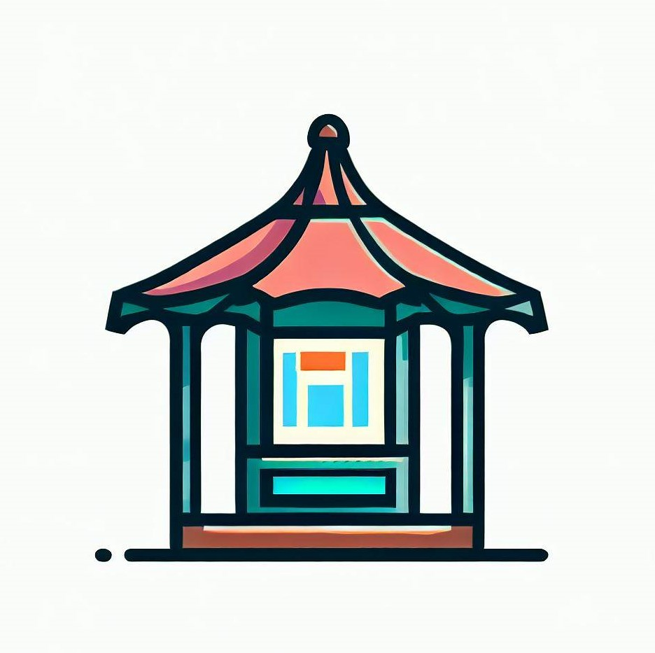

# Gazebo CMS
## An experiment CMS project inspired by WordPress, written in Rust

This is a side-project for myself to practice and grow my Rust (and related) skills. The main idea behind this project is to explore and
re-create some parts of WordPress using Rust in order to pick up new things, solidify what I've learnt already, understand and commit to muscle memory.

**The main tech stack so far:** Rust, Warp, PostgreSQL, Yew, Trunk, WebAssembly

Why WordPress? Because I love WordPress and I know it like the back of my hand. It's that simple. I also work in the publishing industry, building tools and platforms for editors and marketers, so _content management_ has a deeper meaning for me. However, I don't consider WP to "just" be a blogging platform (I don't think that's true anymore), but a framework. _Gazebo_ enables me to combine my technical expertise with my industry experience.

_Project init: 2023-Jan-13_

**Aims and limitations:**

From a technical perspective, my goal with this project is to create a prototype for a basic CMS flow.

Certainly, re-implementing a full-fledged WordPress-like CMS is a non-trivial and substantial undertaking. Completing such a project alone within a reasonable timeframe and to the highest standards would be challenging.

At this stage, my primary aim is to deepen my knowledge of Rust and related technologies, and to practice regularly in diverse ways. I also intend to seek feedback from peers or potential employers, leveraging this project as a demonstration of my skills. The extensive nature of a CMS like WordPress, which has evolved into more of a framework, provides an ideal subject for this purpose.

Cherrypicking certain parts to re-implement is a great method for me to keep the project engaging and the learning experience interesting. It helps me to maintain focus on thinking critically about data structures and modelling, databases and communication, content creation and user management, APIs, frontend/backend separation/connection etc.

Even a smaller module, like permalink-generation has a lot of hidden knowledge, something that has already taught me a great deal and not just about Rust per se.

**What if...**

While it remains speculative and wishful thinking, if I can reach escape velocity with this prototyping exercise and gain a certain level of (internal) success, there is always the potential for it to evolve into a real product. However, for now, my primary focus is on honing my skills, learning, and creating a valuable learning experience.

---

Gazebo CMS | 2023 | Attila Bakos | @a-bakos
